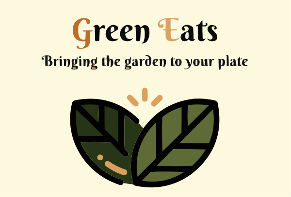
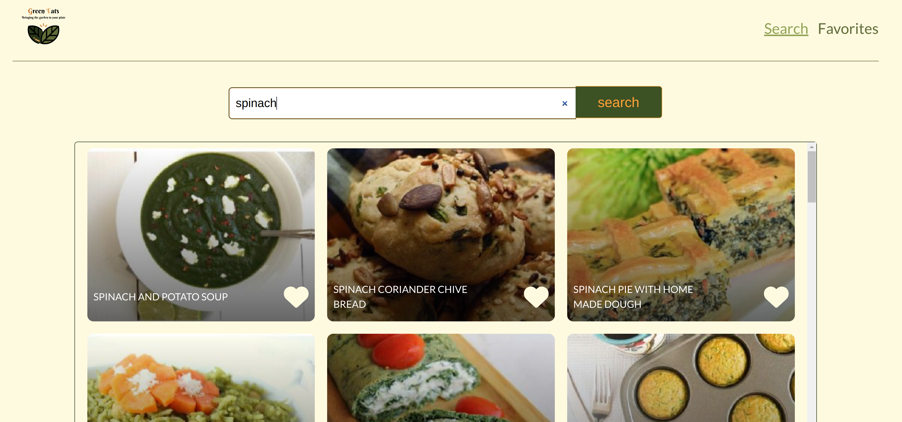

<div id="top"></div>

<!-- PROJECT LOGO -->
<br />
<div align="center">
  <a href="https://github.com/steffFrank/vegetarian-recipe">
    
  </a>

<h3 align="center">REACT - VEGETARIAN RECIPES</h3>

  <p align="center">
    This project is a vegetarian recipes app built with React. The app provides a comprehensive database of vegetarian recipes that users can search and browse through. Users can also save their favorite recipes.   
    <br />
    <br />
    <a href="https://green-eats-veg.netlify.app/">View Demo</a>
    ·
    <a href="https://github.com/steffFrank/vegetarian-recipe/issues">Report Bug</a>
    ·
    <a href="https://github.com/steffFrank/vegetarian-recipe/issues">Request Feature</a>
  </p>
</div>

<!-- TABLE OF CONTENTS -->
<details>
  <summary>Table of Contents</summary>
  <ol>
    <li>
      <a href="#about-the-project">About The Project</a>
      <ul>
        <li><a href="#built-with">Built With</a></li>
      </ul>
    </li>
    <li>
      <a href="#getting-started">Getting Started</a>
      <ul>
        <li><a href="#prerequisites">Prerequisites</a></li>
        <li><a href="#installation">Installation</a></li>
      </ul>
    </li>
    <li><a href="#usage">Usage</a></li>
    <li><a href="#contributing">Contributing</a></li>
    <li><a href="#license">License</a></li>
    <li><a href="#contact">Contact</a></li>
    <li><a href="#acknowledgments">Acknowledgments</a></li>
  </ol>
</details>

<!-- ABOUT THE PROJECT -->
## About The Project  

[](https://green-eats-veg.netlify.app/)
<p align="right">(<a href="#top">back to top</a>)</p>

### Built With

* [React.js](https://reactjs.org/)
* [React Router](https://reactrouter.com/en/main)
* [Styled Components](https://styled-components.com/)
* [axios](https://www.axios.com/)
* [FontAwesome](https://fontawesome.com/)

<p align="right">(<a href="#top">back to top</a>)</p>  

### Features    
* Search and browse vegetarian recipes  
* Save your favorite recipes  
* Display further information of a recipe   
* Mobile responsive and accessible design  

<!-- GETTING STARTED -->
## Getting Started

### Prerequisites

This is an example of how to list things you need to use the software and how to install them.
* npm
  ```sh
  npm install npm@latest -g
  ```

### Installation

1. Get a free API Key at [https://spoonacular.com/](https://spoonacular.com/)
2. Clone the repo
   ```sh
   git clone https://github.com/steffFrank/vegetarian-recipe.git
   ```
3. Install NPM packages
   ```sh
   npm install
   ```
4. Create an env file and enter these values
   ```
   REACT_APP_APIKEY = ENTER YOUR API
   REACT_APP_APIKEY = https://api.spoonacular.com/recipes/
   REACT_APP_DIET=vegetarian 
   ```

<p align="right">(<a href="#top">back to top</a>)</p>

<!-- USAGE EXAMPLES -->
## Usage
Enter the name of a main ingredient in the search bar, you will get a at max 30 recipes with that ingredients.  
Click on a recipe to get full information about the recipe  
Click on the heart icon to add or remove a recipe from the favorites  

<p align="right">(<a href="#top">back to top</a>)</p>

<!-- CONTRIBUTING -->
## Contributing

Contributions are what make the open source community such an amazing place to learn, inspire, and create. Any contributions you make are **greatly appreciated**.

If you have a suggestion that would make this better, please fork the repo and create a pull request. You can also simply open an issue with the tag "enhancement".
Don't forget to give the project a star! Thanks again!

1. Fork the Project
2. Create your Feature Branch (`git checkout -b feature/AmazingFeature`)
3. Commit your Changes (`git commit -m 'Add some AmazingFeature'`)
4. Push to the Branch (`git push origin feature/AmazingFeature`)
5. Open a Pull Request

<p align="right">(<a href="#top">back to top</a>)</p>

<!-- LICENSE -->
## License

Distributed under the MIT License. See `LICENSE.txt` for more information.

<p align="right">(<a href="#top">back to top</a>)</p>

<!-- CONTACT -->
## Contact

Your Name - [@twitter_handle](https://twitter.com/twitter_handle) - email@email_client.com

Project Link: [https://github.com/steffFrank/vegetarian-recipe](https://github.com/steffFrank/vegetarian-recipe)

<p align="right">(<a href="#top">back to top</a>)</p>


<!-- ACKNOWLEDGMENTS -->
## Acknowledgments

* [start2impact University](https://talent.start2impact.it/)

<p align="right">(<a href="#top">back to top</a>)</p>


